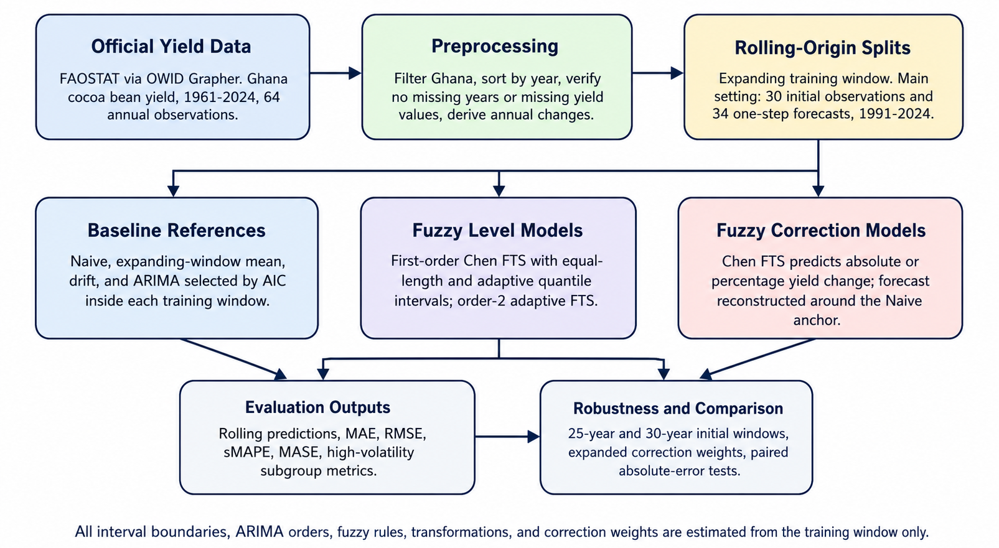
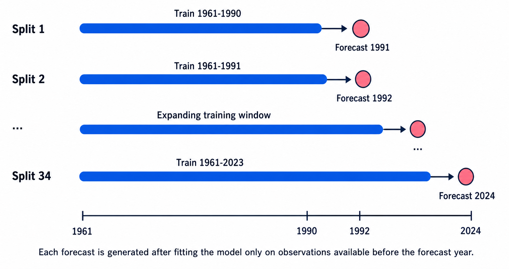
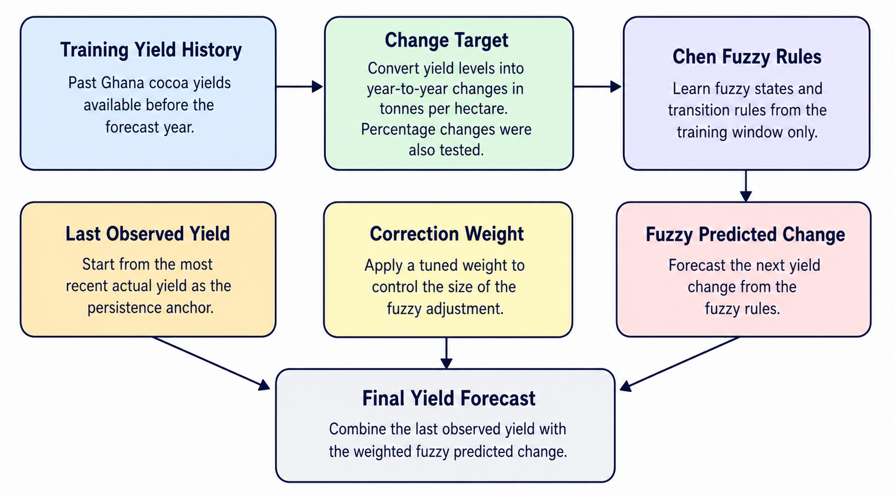
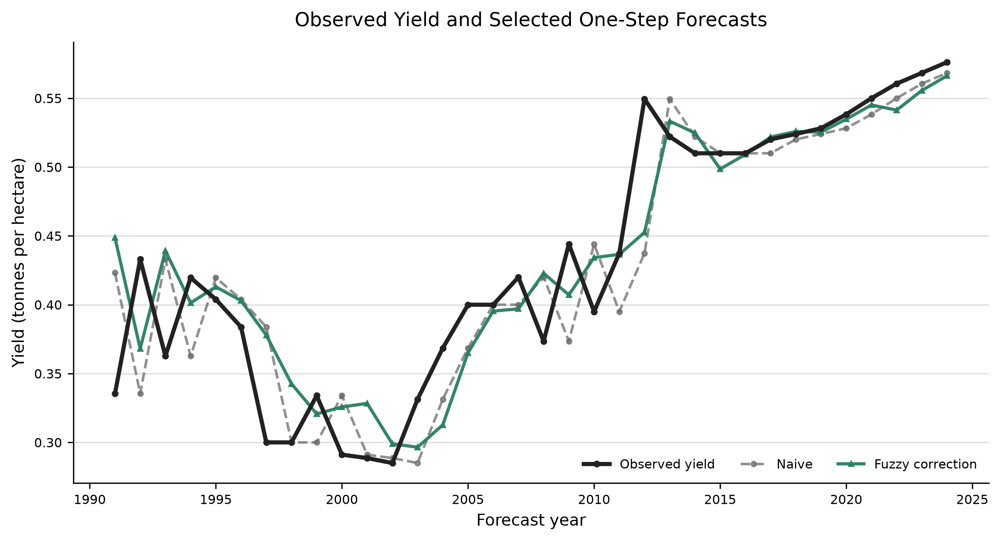
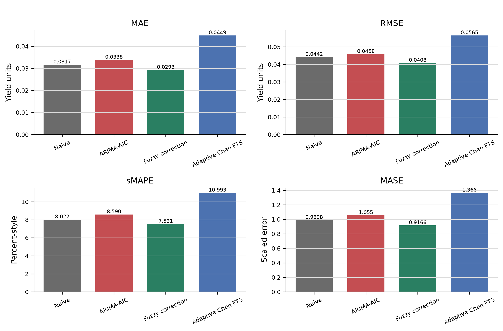
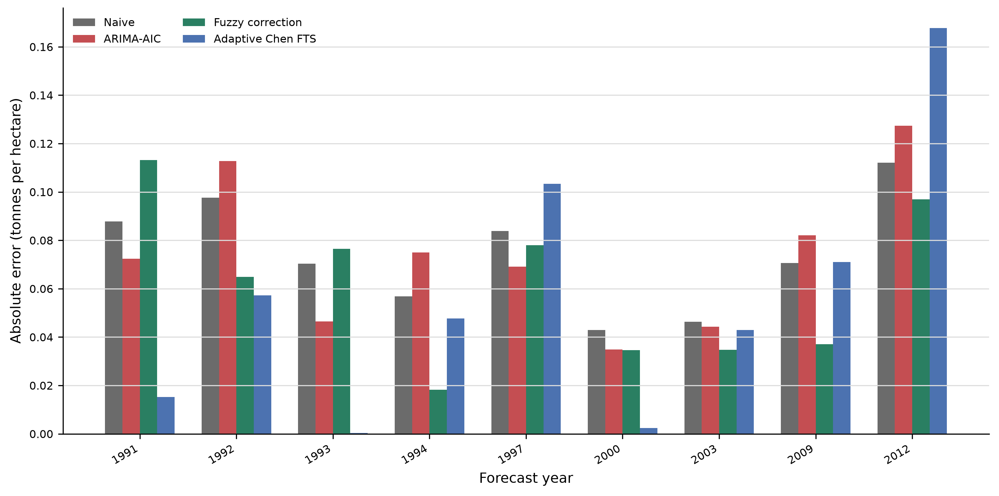
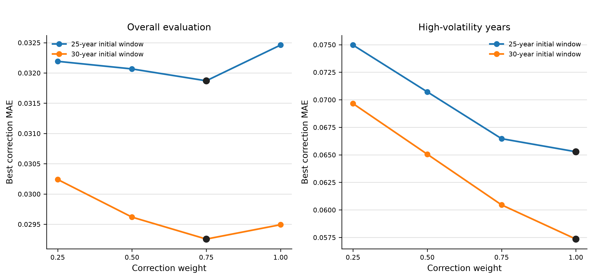
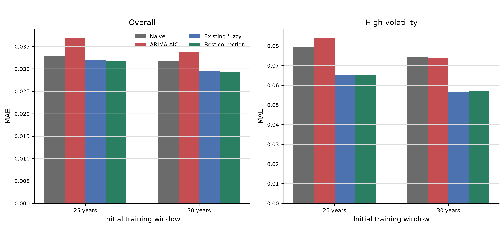
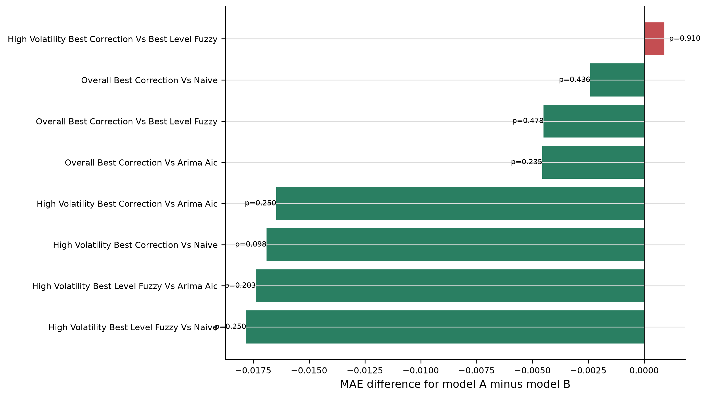

# Adaptive Fuzzy Correction Time-Series Forecasting for Ghana Cocoa Yield Under Rolling-Origin Validation

# Abstract

Accurate cocoa yield forecasting is important for agricultural planning, productivity monitoring, and policy support in Ghana, but national annual yield records are short and can contain irregular year-to-year movements. This study develops an adaptive fuzzy correction time-series framework for one-step-ahead forecasting of Ghana cocoa bean yield using annual FAOSTAT data accessed through Our World in Data for 1961-2024. The evaluation compares Naive, mean, drift, and ARIMA-AIC baselines with Chen fuzzy time-series models using equal-length intervals, adaptive quantile intervals, order-2 rules, and fuzzy correction targets based on absolute and percentage yield change. All models are assessed with rolling-origin validation, with robustness checks across initial training-window sizes and correction weights. The strongest overall configuration, an adaptive absolute-change fuzzy correction model with nine intervals and correction weight 0.75, achieved MAE 0.029255 tonnes per hectare. This reduced MAE by 7.61 percent relative to the Naive baseline and by 13.48 percent relative to ARIMA-AIC. During high-volatility years, fuzzy models produced larger practical gains: the best adaptive level-based fuzzy model reduced MAE by 23.99 percent relative to Naive and 23.54 percent relative to ARIMA-AIC. Paired tests did not reach the 0.05 significance level because the evaluation sample is small, but the high-volatility correction comparison was directionally favorable with Wilcoxon p = 0.097656. The results indicate that fuzzy time-series modeling is most useful for this short agricultural series when it is used to correct a strong persistence forecast, particularly during unstable yield transitions.

**Keywords:** cocoa yield forecasting; fuzzy time series; Chen model; adaptive intervals; rolling-origin validation; agricultural informatics; Ghana

# Introduction

Cocoa is one of Ghana's most important perennial crops, with direct implications for export earnings, rural livelihoods, input planning, and agricultural policy. Cocoa yield is especially important because it measures output per cultivated area rather than production volume alone. National production can change because harvested area changes, while yield gives a more direct view of productivity and production efficiency. Forecasting Ghana cocoa bean yield is therefore relevant for short-horizon agricultural planning and for monitoring whether observed production changes reflect productivity behavior. Public annual data from FAOSTAT, accessed through the Our World in Data Grapher service, make it possible to study long-run Ghana cocoa yield using a reproducible official data source [1], [2].

The forecasting task is technically difficult because the available national yield record is short, annual, and affected by irregular movements. Cocoa yield can respond to agronomic conditions, disease pressure, rainfall variability, farm management, input access, aging farms, and wider sector instability [3]-[5]. These factors may create unstable transitions that are not captured well by simple trend extrapolation. At the same time, short annual datasets make high-capacity machine learning models difficult to justify unless richer covariates and strong validation safeguards are available. A defensible model for this setting should therefore be compact, reproducible, interpretable, and tested against strong simple baselines.

Fuzzy time-series forecasting offers a useful methodological lens for this problem. Since the work of Song and Chissom [7], [8] and the simplified Chen model [9], fuzzy time-series methods have represented numerical observations as linguistic states, constructed fuzzy logical relationships, and produced forecasts through defuzzification. This structure is attractive in agricultural forecasting because it can express state transitions without requiring large training samples or strict distributional assumptions. However, the fuzzy time-series literature also shows that performance depends strongly on interval partitioning, rule grouping, rule weighting, model order, and target representation [10]-[14]. A credible empirical study should therefore evaluate fuzzy time-series designs as a model family rather than rely on a single fuzzy configuration.

Previous cocoa forecasting studies have more commonly addressed production volume, long-horizon scenarios, or broader sectoral modeling than Ghana-specific yield under one-step rolling-origin validation. Quartey-Papafio et al. [6] forecast cocoa production for major producing countries using ARIMA and grey models, which provides an important neighboring benchmark but differs in target variable and method. Cocoa-sector reviews also emphasize modeling needs and production-system challenges more broadly [4], [5]. The present study addresses a narrower and more testable question: whether an interpretable fuzzy time-series framework can improve one-step-ahead forecasting of Ghana annual cocoa bean yield when evaluated against strong reference models under a leakage-aware rolling-origin design.

The central methodological idea is that direct fuzzy modeling of yield level may not be the most effective representation for a short persistent annual series. If the latest observed yield is already a strong local anchor, the Naive forecast can be difficult to beat. A direct level-based fuzzy model may over-adjust away from useful persistence. This study therefore evaluates fuzzy correction models that predict the expected change from the previous observed yield. The final forecast is reconstructed around the latest observed yield using a correction weight. In practical terms, the fuzzy model estimates whether a moderated adjustment should be added to a persistence forecast.

This paper makes four contributions. First, it provides a reproducible Ghana cocoa bean yield forecasting study using an official public data source and a transparent data preparation pipeline. Second, it evaluates classical and extended Chen fuzzy time-series designs under rolling-origin validation, including equal-length intervals, adaptive quantile intervals, and order-2 fuzzy rules. Third, it tests a fuzzy correction formulation in which fuzzy rules forecast yield change and the final forecast is reconstructed around the latest observed yield. Fourth, it separates overall accuracy from high-volatility-year performance, showing that fuzzy models are especially useful during unstable agricultural transitions.

# Related Work

Cocoa forecasting research sits at the intersection of agricultural productivity analysis, commodity-sector modeling, and time-series prediction. In Ghana, yield is shaped by biological, management, environmental, and institutional factors. Yield-gap analysis has shown that Ghanaian cocoa productivity is influenced by farm-level and agronomic constraints, making yield a meaningful target for productivity-oriented forecasting [3]. Recent cocoa-sector work also highlights pressure from climate variability, disease, aging farms, price incentives, and sustainability challenges [4], [5]. These issues make yield behavior irregular enough that a forecasting study should not rely only on linear extrapolation.

The accessible cocoa forecasting literature suggests that production volume has received more attention than Ghana-specific yield. Production forecasting is useful, but it answers a different question because national production can change through both area and productivity. Yield forecasting is closer to the question of productivity per unit area. A separate long-horizon study on cocoa yields for 2050 indicates broader interest in cocoa yield futures, but that type of scenario-oriented work differs from rolling-origin one-step forecast evaluation [27]. This leaves room for a focused Ghana yield study that compares interpretable fuzzy designs with classical benchmarks.

Fuzzy time-series forecasting was introduced by Song and Chissom as a way to model temporally ordered data through fuzzy sets and fuzzy relations [7], [8]. Chen later proposed a simpler and computationally efficient fuzzy time-series model based on fuzzy logical relationship groups and arithmetic defuzzification [9]. The Chen framework remains widely used because it is transparent and modular. A crisp observation is mapped into an interval-based fuzzy state; observed state transitions form fuzzy logical relationships; relationships with the same antecedent are grouped; and a crisp forecast is obtained through defuzzification. This workflow is attractive for short agricultural series because it is auditable and does not require large-scale training data.

The classical Chen model is not a complete recipe. Forecast accuracy can be sensitive to the universe of discourse, interval length, number of intervals, treatment of repeated consequents, and fallback behavior for unseen antecedents. Huarng [10] showed that interval length can materially affect fuzzy time-series accuracy, and ratio-based interval work reinforced the importance of partition design [11]. Chen's high-order fuzzy time-series formulation shows how additional fuzzy-state history can be incorporated [12], while Yu [13] demonstrated the value of weighting repeated fuzzy relationships. Survey evidence also indicates that fuzzy time-series design remains an active methodological area rather than a settled single-model procedure [14].

Interval partitioning is especially important in small annual datasets. Equal-length intervals are transparent and stable, but they may allocate intervals to sparse regions of the training range. Adaptive quantile intervals use the empirical training distribution and can place more boundaries in dense regions, although they may be sensitive near extremes and can shift from split to split. Higher-order fuzzy rules offer another possible extension by using more than one previous fuzzy state, but they also increase sparsity because the number of possible antecedent combinations grows quickly. For this reason, the present study treats adaptive intervals and order-2 rules as empirical comparisons rather than assuming that either must improve performance.

Fuzzy time-series models have been applied to agricultural forecasting tasks, including rice production, agricultural process forecasting, and plantation-crop production contexts [17]-[20]. These studies support the relevance of fuzzy methods in agriculture, but crop, target, geography, and validation design differ across applications. Cocoa-specific fuzzy work appears more limited. A neighboring study used a fuzzy time-series Markov chain model to forecast cocoa plant disease counts in Bendungan district [22], while fuzzy logic has also been used in cocoa-related decision support such as post-harvest technology selection [23]. These studies connect fuzzy methods with cocoa-related applications, but they do not address national Ghana cocoa bean yield forecasting under a comparative rolling-origin design.

Forecasting studies also need strong baselines and appropriate validation. Simple models often perform surprisingly well in short persistent series. The Naive forecast is particularly important because it predicts the next observation as the most recent observation. Mean, drift, and ARIMA provide additional reference points. Hyndman and Koehler [24] emphasized careful use of forecast accuracy measures, while later forecast-evaluation literature discusses cross-validation, temporal leakage, weak baselines, and other pitfalls in time-series evaluation [25], [26]. Rolling-origin validation responds to these issues by simulating a sequence of real forecast decisions: train on the past, forecast the next period, then roll forward [29], [30].

This study is positioned as an applied information-technology contribution to agricultural forecasting. Its value lies in combining training-window interval construction, Chen-style fuzzy rules, change-target correction around a persistence anchor, high-volatility analysis, rolling-origin validation, and benchmark comparison against statistical references. This combination is useful for short annual yield series where interpretability, temporal validation, and performance during unstable years matter as much as average full-sample accuracy.

# Materials and Methods

The forecasting workflow is organized around four stages: preparation of the Ghana cocoa yield series, rolling-origin model estimation, comparison of benchmark and fuzzy time-series models, and robustness assessment. Fig. 1 presents this workflow.

Fig. 1. Forecasting and evaluation framework from public yield data preparation through rolling-origin model comparison, robustness analysis, and statistical comparison.

## Data, preprocessing, and validation

This study used annual Ghana cocoa bean yield as the forecasting target. The original provider is the Food and Agriculture Organization of the United Nations through FAOSTAT, accessed through the Our World in Data Grapher endpoint for cocoa bean yields [1], [2]. The processed Ghana series contains 64 annual observations from 1961 to 2024. The detected source variable was `Cocoa beans - Yield (tonnes per hectare)`, standardized in the study dataset as `yield_tonnes_per_hectare`.

The preprocessing workflow filtered the raw multi-country file to Ghana, sorted observations by year, and retained the year and yield fields needed for univariate forecasting. Duplicate-year handling was conservative: exact duplicate years were removed only when their yield values were identical, while conflicting duplicate values would stop the workflow. No interpolation was applied. The final Ghana series had no missing years, no missing yield values, and no duplicate years after cleaning. Derived variables were computed for exploratory and modeling use, including lagged yield, absolute annual change, percentage annual change, and absolute percentage change.

Table 1 summarizes the verified data and validation setup.

Table 1. Verified data and rolling-origin validation setup.

| Item | Value |
|---|---:|
| Country | Ghana |
| Forecast target | Cocoa bean yield |
| Unit | Tonnes per hectare |
| Frequency | Annual |
| First observation | 1961 |
| Last observation | 2024 |
| Processed observations | 64 |
| Missing years | 0 |
| Missing yield values | 0 |
| Main initial training observations | 30 |
| Main forecast years | 1991-2024 |
| Main rolling-origin splits | 34 |
| Forecast horizon | 1 year |
| Evaluation high-volatility threshold | 12.466566 percent absolute annual change |
| High-volatility evaluation years | 9 |
| Non-high-volatility evaluation years | 25 |

The forecasting experiment used rolling-origin validation rather than random splitting. For each split, models were trained only on observations available before the forecast year and then used to predict the next annual yield. The main validation setting used 30 initial training observations, so the first forecast year was 1991 and the final forecast year was 2024. This produced 34 one-step-ahead forecasts per model. A 25-observation initial training window was also used in robustness analysis to examine whether conclusions were stable when the evaluation period began earlier.

For each split, the validation table recorded the training period, forecast year, actual yield, previous yield, actual annual change, percentage annual change, and an in-sample Naive MAE scale for MASE. The high-volatility evaluation label was computed after the evaluation period was defined. The threshold was the 75th percentile of the 34 evaluation-period absolute percentage changes, equal to 12.466566 percent. A forecast year was labeled high-volatility when its absolute percentage change was greater than or equal to this threshold. These labels were used only for subgroup evaluation and were not supplied to the forecasting models.

Fig. 2. Rolling-origin validation design showing expanding training windows and one-year-ahead forecasts from 1991 to 2024.

## Forecasting models

The study evaluated 48 forecasting scenarios in the main experiment. Four were non-fuzzy reference models, 12 were level-based fuzzy time-series models, and 32 were fuzzy correction models. The purpose of this design was to compare fuzzy models not only against each other but also against strong simple and statistical references.

The baseline references were Naive, expanding-window mean, drift, and ARIMA selected by AIC. The Naive model forecasts the next yield as the most recent observed training value. The mean model uses the expanding-window average. The drift model extrapolates a linear change from the first to the most recent training observation. ARIMA-AIC searched *p* in {0, 1, 2}, *d* in {0, 1}, and *q* in {0, 1, 2} inside each training window, using the model with the lowest AIC and a finite one-step forecast. If all ARIMA candidates failed, the split would fall back to the Naive forecast.

The fuzzy models follow the Chen fuzzy time-series framework [9]. For a training sequence, the universe of discourse is partitioned into intervals and each crisp value is fuzzified into an interval state. First-order fuzzy logical relationships are formed from consecutive states and grouped by antecedent. When an antecedent has multiple consequents, the crisp forecast is obtained using a frequency-weighted midpoint rule. If the current antecedent has no matching rule in the training window, the forecast uses the midpoint of the current state and records this fallback in the prediction metadata.

Two interval strategies were compared. Equal-length intervals used the training-window minimum and maximum, expanded the range by 5 percent on each side, and divided the expanded universe into *k* equal intervals. Adaptive quantile intervals computed boundaries from training-window quantiles only. Duplicate quantile boundaries were removed to prevent zero-width intervals, and the effective interval count was recorded. Candidate interval counts were *k* = 5, 7, 9, and 11. Intervals were left-closed and right-open, except for the final interval, which was closed on both sides.

Order-2 fuzzy models were included as a controlled test of higher-order fuzzy-state history. Instead of using only the most recent fuzzy state, an order-2 rule uses the two most recent states as the antecedent. If an order-2 antecedent was unseen, the forecast first fell back to the matching first-order rule for the current state. If that first-order rule was also unseen, it used the current interval midpoint. This fallback hierarchy was necessary because higher-order rules increase the number of possible antecedent combinations while the annual Ghana yield series is short.

The main methodological extension is fuzzy correction forecasting. Direct level-based fuzzy forecasting estimates the next yield level. Correction forecasting instead estimates the next change relative to the most recent observed yield. Two transformed targets were evaluated: absolute yield change and percentage yield change. Transformed targets were computed from the training window only. A first-order Chen model was fitted to the transformed sequence, and the transformed forecast was reconstructed into a yield forecast around the previous observed yield. For absolute change, the final forecast equals the previous yield plus a weighted predicted change. For percentage change, the final forecast applies a weighted predicted percentage change to the previous yield.

The main experiment used correction weights 0.50 and 1.00. The robustness analysis expanded the grid to 0.25, 0.50, 0.75, and 1.00. These weights were evaluated as a sensitivity grid rather than as an automatically tuned real-time parameter. The best value, 0.75, should therefore be interpreted as a robustness-selected damped correction weight for this dataset. In an operational deployment, the same grid should be selected by an inner rolling validation procedure within the available historical data before forecasting future years.

Fig. 3. Adaptive fuzzy correction mechanism in which Chen FTS predicts transformed yield change and the final forecast is reconstructed around the previous observed yield using a correction weight.

Table 2 summarizes the model families used in the main rolling-origin experiment.

Table 2. Model families evaluated in the main rolling-origin experiment.

| Model group | Forecast target | Count |
|---|---|---:|
| Baseline reference models | Yield level | 4 |
| First-order and order-2 fuzzy level models | Yield level | 12 |
| Fuzzy correction models | Absolute yield change | 16 |
| Fuzzy correction models | Percentage yield change | 16 |
| Total |  | 48 |

To make the fuzzy-state mechanism auditable, the final training window was also used to export fuzzy logical relationship groups. Table 3 gives examples from the adaptive absolute-change correction model with nine intervals. The states are ordered by annual yield change, from large negative change to large positive change. The examples show that the fuzzy model is not a black box: it records state-transition tendencies such as rebound after large negative changes and mean reversion after large positive changes.

Table 3. Representative final-window fuzzy logical relationship groups for the adaptive absolute-change correction model with nine intervals.

| Antecedent state and change interval | Dominant consequent pattern | Weighted forecast change | Interpretation |
|---|---|---:|---|
| A1, -0.0878 to -0.0420 t/ha | A9:3; A8:2; A4:1; A5:1 | 0.048815 | Large negative changes were often followed by rebound states |
| A5, 0.0000 to 0.0075 t/ha | A5:2; A6:2; A1:1; A4:1; A7:1; A8:1; A9:1 | 0.012056 | Near-stable changes had mixed but mildly positive consequents |
| A9, 0.0555 to 0.1121 t/ha | A1:3; A2:1; A3:1; A5:1; A9:1 | -0.021415 | Large positive changes were often followed by downward correction |

## Evaluation, robustness, and statistical comparison

Four accuracy metrics were reported. MAE measures average absolute forecast error in tonnes per hectare. RMSE gives larger errors greater influence. sMAPE provides a percentage-style symmetric error measure. MASE scales absolute errors by the in-sample Naive MAE for the corresponding training window [24]. Lower values are better for all four metrics. MAE was the main selection metric because the outcome is a physical yield quantity and the study emphasizes average one-step forecast accuracy.

Robustness was evaluated in two ways. First, the model pipeline was rerun under both 25-year and 30-year initial training windows. Second, correction weights were expanded to 0.25, 0.50, 0.75, and 1.00 for the fuzzy correction family. This produced 3,504 sensitivity predictions across the two validation-window settings and 4,672 robustness predictions for the expanded correction-weight grid.

Paired error comparisons were computed for selected model pairs using paired absolute forecast errors. The tests included the Wilcoxon signed-rank test, paired t-test on absolute-error losses, and sign test. Because the canonical validation sample contains only 34 annual forecasts and the high-volatility subgroup contains only 9 forecasts, p-values are interpreted as indicators of statistical power and directional support rather than as the sole basis for practical relevance. The statistical comparisons therefore qualify the strength of evidence while the main interpretation also considers error reductions in high-volatility years.

# Results

## Overall forecasting performance

The main rolling-origin experiment generated the expected 1,632 predictions, equal to 34 validation splits multiplied by 48 model scenarios. Each validation split had exactly one prediction for each model. No forecast yield values were missing, non-finite, or duplicated within split-model pairs. The sensitivity analysis generated 3,504 predictions, while the expanded correction-weight robustness analysis generated 4,672 correction-model predictions.

Fig. 4 shows the observed yield trajectory and selected one-step forecasts. The figure illustrates why the Naive model is a strong benchmark: Ghana annual cocoa yield has local persistence, so the most recent observation often provides a reasonable short-horizon anchor. The forecasting problem is therefore not simply whether fuzzy models can track the yield series, but whether they can improve on a strong persistence reference without over-adjusting.

Fig. 4. Observed Ghana cocoa bean yield and focused one-step-ahead forecasts from the Naive baseline and the selected adaptive fuzzy correction model.

The baseline comparison confirms the strength of persistence. In the main 30-year initial-window evaluation, Naive achieved overall MAE 0.031665, drift achieved 0.031724, and ARIMA-AIC achieved 0.033814. The expanding-window mean was much weaker, with MAE 0.128253, indicating that the series is not well represented by a long-run average forecast. Direct level-based fuzzy models were competitive but did not beat Naive overall. The best level-based fuzzy model was the first-order Chen model with equal-length intervals and 11 intervals, with MAE 0.033754.

The strongest overall result came from fuzzy correction. In the main 48-model experiment, the best correction model was the adaptive absolute-change Chen model with nine intervals and correction weight 1.00, with MAE 0.029493. In the expanded correction-weight robustness analysis, the same adaptive absolute-change structure with weight 0.75 improved further to MAE 0.029255, RMSE 0.040835, sMAPE 7.531065, and MASE 0.916646. This result reduced MAE by 7.61 percent relative to Naive and by 13.48 percent relative to ARIMA-AIC.

Table 4 reports selected overall results. Model IDs are retained only as reproducibility labels.

Table 4. Selected overall forecasting results under rolling-origin validation.

| Model description | Reproducibility ID | MAE | RMSE | sMAPE | MASE |
|---|---|---:|---:|---:|---:|
| Selected fuzzy correction model, adaptive intervals, nine intervals, weight 0.75 | `chen_change_adaptive_k9_w075` | 0.029255 | 0.040835 | 7.531065 | 0.916646 |
| Fuzzy absolute-change correction, adaptive intervals, nine intervals, weight 1.00 | `chen_change_adaptive_k9_w100` | 0.029493 | 0.041516 | 7.595734 | 0.923749 |
| Naive baseline | `baseline_naive` | 0.031665 | 0.044208 | 8.022277 | 0.989755 |
| Drift baseline | `baseline_drift` | 0.031724 | 0.044589 | 8.052213 | 0.989752 |
| Best level-based fuzzy model, equal intervals, 11 intervals | `chen_equal_k11` | 0.033754 | 0.049464 | 8.579672 | 1.041204 |
| ARIMA selected by AIC | `baseline_arima_aic` | 0.033814 | 0.045830 | 8.590255 | 1.054773 |
| Best order-2 adaptive fuzzy level model, 11 intervals | `chen_order2_adaptive_k11` | 0.040666 | 0.058134 | 10.381807 | 1.254870 |
| Mean baseline | `baseline_mean` | 0.128253 | 0.148016 | 32.654630 | 3.965928 |

Fig. 5. Overall MAE, RMSE, sMAPE, and MASE for selected benchmark and fuzzy forecasting models.

## Fuzzy model design effects

The interval comparison shows that adaptive quantile intervals were not uniformly superior. For direct level forecasting, equal-length intervals outperformed adaptive intervals in overall MAE for all four tested interval counts. The best equal-interval level model was the first-order Chen model with equal-length intervals and 11 intervals, which achieved an overall MAE of 0.033754. The best first-order adaptive level model used nine adaptive quantile intervals and achieved an overall MAE of 0.044877. This suggests that adaptive quantile boundaries did not improve the full-sample level-forecasting task, possibly because small annual training windows made adaptive boundaries less stable.

The high-volatility subgroup produced a different pattern. Adaptive intervals improved high-volatility MAE at selected interval counts, especially with nine intervals. The first-order adaptive level model with nine intervals achieved a high-volatility MAE of 0.056440, compared with 0.081245 for the corresponding equal-interval model with nine intervals. Thus, adaptive quantile partitioning was not the best overall level strategy, but it helped represent some volatile transitions.

Order-2 fuzzy models also produced mixed results. In the overall evaluation, order-2 improved MAE only with 11 adaptive quantile intervals, reducing adaptive level MAE from 0.045697 to 0.040666. With 5, 7, and 9 intervals, order-2 models were weaker than their first-order adaptive counterparts. In the high-volatility evaluation, order-2 improved some configurations but worsened the strongest first-order adaptive configuration with nine intervals. This pattern is consistent with sparse antecedent combinations in short annual data.

The correction-target comparison was more decisive. Absolute-change correction outperformed percentage-change correction in both overall and high-volatility views. In the main experiment, the best absolute-change correction model had overall MAE 0.029493, while the best percentage-change correction model had MAE 0.030854. In the high-volatility subgroup, the best absolute-change correction model had MAE 0.057350, while the best percentage-change correction model had MAE 0.058961. The differences are small but consistent, and they support the use of absolute-change correction as the primary representation for this yield scale.

Table 5 summarizes the most important fuzzy design results.

Table 5. Summary of the main fuzzy-model design comparisons.

| Evaluation view | Comparison | Best result | Interpretation |
|---|---|---:|---|
| Overall level forecasting | Equal vs adaptive intervals | Equal-interval first-order Chen model with 11 intervals, MAE 0.033754 | Equal intervals were stronger for direct level forecasts |
| High-volatility level forecasting | Equal vs adaptive intervals | Adaptive first-order Chen model with nine intervals, MAE 0.056440 | Adaptive intervals helped in volatile years |
| Overall order comparison | First-order vs order-2 adaptive | Order-2 adaptive Chen model with 11 intervals, MAE 0.040666 | Order-2 improved only selected settings |
| Overall target comparison | Absolute vs percentage change | Adaptive absolute-change correction with nine intervals and weight 1.00, MAE 0.029493 | Absolute-change correction was stronger |
| Final robustness result | Expanded correction weights | Adaptive absolute-change correction with nine intervals and weight 0.75, MAE 0.029255 | Damped adaptive correction was best overall |

## Robustness, volatility, and statistical evidence

The high-volatility evaluation produced the clearest evidence that fuzzy modeling is useful during unstable yield transitions. The threshold identified nine high-volatility forecast years: 1991, 1992, 1993, 1994, 1997, 2000, 2003, 2009, and 2012. In this subgroup, the best high-volatility MAE was obtained by the first-order adaptive level fuzzy model with nine intervals, which reached an MAE of 0.056440. The best correction model in the same subgroup was the adaptive absolute-change fuzzy correction model with nine intervals and correction weight 1.00, which reached an MAE of 0.057350. Both fuzzy models were substantially lower than the Naive baseline at 0.074256 and ARIMA-AIC at 0.073820. The level-based fuzzy model reduced high-volatility MAE by 23.99 percent relative to Naive, while the correction model reduced it by 22.77 percent.

Fig. 6. Absolute forecast errors for selected models in evaluation years with high annual percentage yield changes.

Robustness checks strengthened the overall fuzzy correction result. When correction weights were expanded to 0.25, 0.50, 0.75, and 1.00, the best overall correction weight was 0.75 under both validation-window settings. With 25 initial training observations, the adaptive absolute-change fuzzy correction model with nine intervals and correction weight 0.75 achieved an MAE of 0.031870, compared with 0.032918 for the Naive baseline and 0.037014 for ARIMA-AIC. With 30 initial training observations, the same model achieved an MAE of 0.029255, compared with 0.031665 for the Naive baseline and 0.033814 for ARIMA-AIC. This indicates that the fuzzy correction signal was useful but benefited from damping.

Fig. 7. Best correction-model MAE by correction weight across validation-window settings.

Fig. 8. MAE comparison for baseline references, existing fuzzy models, and best fuzzy correction models across initial training-window settings.

Paired statistical tests were directionally supportive but not significant at the 0.05 level. In the canonical 30-year initial-window setting, the adaptive absolute-change fuzzy correction model with nine intervals and correction weight 0.75 had an overall MAE of 0.029255, compared with 0.031665 for the Naive baseline. The paired MAE difference was -0.002409 in favor of the fuzzy correction model, with a Wilcoxon p-value of 0.436471. Against ARIMA-AIC, the paired MAE difference was -0.004559, with a Wilcoxon p-value of 0.234696. High-volatility comparisons were more favorable in direction but still limited by the small subgroup. The best fuzzy correction model for high-volatility years had an MAE of 0.057350, compared with 0.074256 for the Naive baseline, with a Wilcoxon p-value of 0.097656.

Table 6 reports the selected paired comparisons.

Table 6. Selected paired absolute-error comparisons.

| Comparison | Sample size | Model A MAE | Model B MAE | MAE difference A minus B | Wilcoxon p-value |
|---|---:|---:|---:|---:|---:|
| Overall correction vs Naive | 34 | 0.029255 | 0.031665 | -0.002409 | 0.436471 |
| Overall correction vs ARIMA-AIC | 34 | 0.029255 | 0.033814 | -0.004559 | 0.234696 |
| Overall correction vs best level fuzzy | 34 | 0.029255 | 0.033754 | -0.004499 | 0.477588 |
| High-volatility correction vs Naive | 9 | 0.057350 | 0.074256 | -0.016906 | 0.097656 |
| High-volatility level fuzzy vs Naive | 9 | 0.056440 | 0.074256 | -0.017816 | 0.250000 |

Fig. 9. Paired absolute-error MAE differences and descriptive Wilcoxon p-values for selected benchmark and fuzzy-model comparisons.

Taken together, the results support four findings. First, Naive is a strong baseline for Ghana annual cocoa yield. Second, direct level-based fuzzy models are competitive but do not beat Naive overall. Third, fuzzy models are stronger than the baselines during high-volatility years, where practical error reductions are larger. Fourth, adaptive fuzzy correction is the strongest overall approach, especially when the correction weight is damped to 0.75.

# Discussion

## Interpretation and contribution

The main finding is that fuzzy time-series modeling becomes most effective in this case when it is used as a correction mechanism around a persistence anchor. Direct level-based fuzzy models did not beat the Naive baseline overall. The best direct level model, the first-order Chen model with equal-length intervals and 11 intervals, was close to ARIMA-AIC but weaker than the Naive baseline. This matters because a weaker study design could have overstated fuzzy-model performance by comparing only against poor baselines. In this dataset, the Naive model was difficult to beat because Ghana annual cocoa yield shows local persistence.

The correction formulation changes the forecasting problem. Instead of asking fuzzy rules to predict the entire next yield level, the model asks them to estimate the next deviation from the last observed yield. This design preserves the most useful part of the Naive baseline while allowing fuzzy rules to add directional and magnitude information from historical state transitions. The robustness result suggests that a full correction can over-adjust. A correction weight of 0.75 produced the best overall result under both 25-year and 30-year initial-window settings, indicating that the fuzzy signal is useful but should be moderated in a short annual series.

The high-volatility results are the strongest practical argument for the framework. During unstable yield transitions, the best fuzzy models reduced MAE by approximately 23-24 percent relative to the Naive baseline. These are the years in which agricultural planning is most exposed to forecast error. Standard persistence and ARIMA references were adequate competitors in calm periods, but they were less effective in the high-volatility subgroup. This supports a practical interpretation: fuzzy state-transition models are particularly useful when the series moves away from ordinary persistence behavior.

The interval and rule-order results reinforce the need for empirical comparison. Adaptive quantile intervals did not dominate equal-length intervals for overall level forecasting, even though they helped selected high-volatility configurations. Order-2 fuzzy rules also improved some settings but did not become the best overall or high-volatility model. These results are consistent with the small-sample trade-off in fuzzy time-series design: more flexible partitioning and longer antecedent histories can capture additional structure, but they can also increase instability and sparsity.

## Practical implications and limitations

The practical implication is that short annual agricultural series should be modeled with strong attention to persistence and volatility. In many official crop-yield datasets, the latest observation contains substantial information about the next observation. A method that ignores this can look sophisticated but perform poorly. The fuzzy correction framework offers a middle path: it keeps the persistence anchor and uses fuzzy rules only to adjust it. This makes the method interpretable and suitable for settings where only the target series is available.

The exported fuzzy logical relationship groups also strengthen the interpretability claim. The final-window rule example shows that the model can represent rebound after large negative annual changes and downward correction after large positive annual changes. This is useful for agricultural informatics because the model output can be inspected as a set of state-transition summaries rather than treated as an opaque numerical routine.

The correction-weight result should be used carefully. The 0.75 weight improved robustness results under both validation-window settings, but it was not automatically tuned inside each forecast origin. For practical deployment, the correction-weight grid should be selected by an inner rolling validation procedure using only historical data available before the forecast year. This is an important implementation detail because otherwise a reviewer or practitioner could interpret the weight as a retrospectively chosen parameter.

Several limitations remain. The dataset contains only 64 annual observations, and the canonical evaluation period contains only 34 one-step forecasts. This restricts statistical power. The paired tests were directionally supportive but not statistically significant at the 0.05 level, so they should be reported as descriptive rather than confirmatory. The high-volatility subgroup contains only 9 evaluation years, which is too small for strong subgroup inference even though the practical error reductions are substantial. The study is also univariate and cannot explain the causes of volatility because it does not model rainfall, temperature, disease pressure, input use, soil conditions, prices, harvested area, or policy changes.

The study differs from prior cocoa forecasting work in its target, validation design, and method comparison. Forecasting cocoa production across major producers is useful [6], but production volume differs from yield and does not directly test a Ghana-only fuzzy correction framework. The study is also distinct from fuzzy applications in rice, palm oil, agricultural processes, cocoa disease counts, and cocoa-related decision support [17]-[23]. Those works support the broader relevance of fuzzy methods, but they do not remove the need for commodity-specific validation.

Future work should test whether the correction framework generalizes beyond this setting. A multivariate version could include climate indicators, harvested area, disease information, input proxies, or remote-sensing features if reliable historical data are available. A multi-country cocoa yield study could examine whether the correction approach transfers across production systems. Additional fuzzy designs, such as fuzzy Markov variants, optimized partitioning, or ensemble correction models, could be compared under the same rolling-origin protocol. Multi-step forecasting should also be evaluated separately because recursive correction forecasts may behave differently from one-step forecasts.

# Conclusion

This study developed and evaluated an adaptive fuzzy correction time-series framework for Ghana annual cocoa bean yield forecasting. Using 64 annual observations from 1961 to 2024 and a rolling-origin one-step validation design, the study compared Naive, mean, drift, ARIMA-AIC, first-order Chen fuzzy time-series models, equal and adaptive interval strategies, order-2 fuzzy rules, and fuzzy correction models based on absolute and percentage yield change. The strongest overall result was obtained by the adaptive absolute-change fuzzy correction model with nine intervals and correction weight 0.75. It achieved MAE 0.029255, improving on Naive at 0.031665 and ARIMA-AIC at 0.033814 in the canonical validation setting.

The findings show that fuzzy time-series modeling is most useful in this case when it is used as a correction mechanism around a strong persistence anchor. Direct level-based fuzzy models were competitive but did not beat Naive overall. Adaptive quantile intervals and order-2 rules provided selective benefits, especially in high-volatility analysis, but they were not uniformly superior. For high-volatility years, the best level-based adaptive fuzzy model achieved MAE 0.056440, while the best correction model achieved MAE 0.057350; both were substantially stronger than Naive and ARIMA-AIC in that subgroup.

The main contribution is therefore twofold. First, adaptive fuzzy correction improves overall rolling-origin accuracy for Ghana cocoa bean yield relative to strong benchmark models. Second, fuzzy state-transition models provide practically meaningful error reductions during high-volatility years, which are the periods most relevant for agricultural planning risk. The limited annual sample prevents confirmatory statistical claims, but the leakage-aware validation design, strong baselines, robustness checks, and interpretable fuzzy-rule outputs provide a defensible basis for further fuzzy correction research in agricultural forecasting.

# Data Availability

The data used in this study are publicly available aggregate country-level agricultural data. The original provider is the Food and Agriculture Organization of the United Nations through FAOSTAT. The study accessed the cocoa bean yield series through the Our World in Data Grapher endpoint:

- Data page: https://ourworldindata.org/grapher/cocoa-bean-yields
- CSV endpoint: https://ourworldindata.org/grapher/cocoa-bean-yields.csv?v=1&csvType=full&useColumnShortNames=false
- Metadata endpoint: https://ourworldindata.org/grapher/cocoa-bean-yields.metadata.json

The processed Ghana dataset covers annual cocoa bean yield from 1961 to 2024 and contains 64 observations. The study repository includes the archived raw CSV, metadata file, processed Ghana dataset, data card, integrity report, validation splits, model predictions, metric tables, robustness tables, and generated publication figures. The analysis uses public aggregate data only and does not involve personal, household-level, human-subject, or animal-subject data.

# Code Availability

The source code, canonical notebook, model outputs, result tables, and publication figures will be made available online in a public repository. The code package includes the data preparation workflow, rolling-origin validation framework, baseline models, fuzzy interval construction, Chen fuzzy time-series models, fuzzy correction target transformations, robustness checks, paired error comparisons, and figure-generation scripts.

The canonical study notebook is `notebooks/ghana_cocoa_yield_forecasting.ipynb`. The reproducible Python modules are stored under `src/`, and the generated artifacts are stored under `results/`. A final public repository URL should be inserted before journal submission or provided during peer review according to the journal's code-availability policy.

# Funding Statement

This research received no external funding.

# Conflict of Interest Statement

The authors declare that they have no competing interests.

# References

[1] Food and Agriculture Organization of the United Nations, "FAOSTAT crops and livestock products." https://www.fao.org/faostat/en/#data/QCL

[2] Our World in Data, "Cocoa bean yields," Grapher dataset based on FAOSTAT. https://ourworldindata.org/grapher/cocoa-bean-yields

[3] F. Aneani and K. Ofori-Frimpong, "An Analysis of Yield Gap and Some Factors of Cocoa (Theobroma cacao) Yields in Ghana," Sustainable Agriculture Research, 2013. https://doi.org/10.5539/sar.v2n4p117

[4] "Simulating cocoa production: A review of modelling approaches and gaps," Agricultural Systems, 2023. https://doi.org/10.1016/j.agsy.2023.103614

[5] "Cocoa production in the 2020s: challenges and solutions," CABI Agriculture and Bioscience, 2024. https://doi.org/10.1186/s43170-024-00310-6

[6] T. K. Quartey-Papafio, S. A. Javed, and S. Liu, "Forecasting cocoa production of six major producers through ARIMA and grey models," Grey Systems: Theory and Application, 2020. https://doi.org/10.1108/gs-04-2020-0050

[7] Q. Song and B. S. Chissom, "Fuzzy time series and its models," Fuzzy Sets and Systems, 1993. https://doi.org/10.1016/0165-0114(93)90372-o

[8] Q. Song and B. S. Chissom, "Forecasting enrollments with fuzzy time series - part II," Fuzzy Sets and Systems, 1994. https://doi.org/10.1016/0165-0114(94)90067-1

[9] S. M. Chen, "Forecasting enrollments based on fuzzy time series," Fuzzy Sets and Systems, 1996. https://doi.org/10.1016/0165-0114(95)00220-0

[10] K. H. Huarng, "Effective lengths of intervals to improve forecasting in fuzzy time series," Fuzzy Sets and Systems, 2001. https://doi.org/10.1016/s0165-0114(00)00057-9

[11] "Ratio-based lengths of intervals to improve fuzzy time series forecasting," IEEE Transactions on Systems, Man, and Cybernetics, Part B, 2006. https://doi.org/10.1109/tsmcb.2005.857093

[12] S. M. Chen, "Forecasting enrollments based on high-order fuzzy time series," Cybernetics and Systems, 2002. https://doi.org/10.1080/019697202753306479

[13] T. H. K. Yu, "Weighted fuzzy time series models for TAIEX forecasting," Physica A, 2004. https://doi.org/10.1016/j.physa.2004.11.006

[14] M. Bose and K. Mali, "Designing fuzzy time series forecasting models: A survey," International Journal of Approximate Reasoning, 2019. https://doi.org/10.1016/j.ijar.2019.05.002

[15] "A Novel Stochastic Fuzzy Time Series Forecasting Model Based on a New Partition Method," IEEE Access, 2021. https://doi.org/10.1109/access.2021.3084048

[16] "A new fuzzy time series forecasting method based on clustering and weighted average approach," Journal of Intelligent and Fuzzy Systems, 2020. https://doi.org/10.3233/jifs-179693

[17] "Fuzzy time series model to forecast rice production," FUZZ-IEEE, 2013. https://doi.org/10.1109/fuzz-ieee.2013.6622509

[18] "A Computational Method for Rice Production Forecasting Based on High-Order Fuzzy Time Series," International Journal of Fuzzy Mathematical Archive, 2017. https://doi.org/10.22457/ijfma.v13n2a5

[19] "Forecasting models of agricultural process based on fuzzy time series," IOP Conference Series: Materials Science and Engineering, 2020. https://doi.org/10.1088/1757-899x/986/1/012013

[20] "Measurement of Detection Rate Accuracy in Forecasting Crude Palm Oil Production using Fuzzy Time Series," ICITECH, 2021. https://doi.org/10.1109/icitech50181.2021.9590172

[21] "A Comprehensive Review of Crop Yield Prediction Using Machine Learning Approaches With Special Emphasis on Palm Oil Yield Prediction," IEEE Access, 2021. https://doi.org/10.1109/access.2021.3075159

[22] A. B. Salsabila, Firdaniza, B. N. Ruchjana, and A. S. Abdullah, "Python script fuzzy time series Markov chain model for forecasting the number of diseases cocoa plant in Bendungan district," International Journal of Data and Network Science, 2023. https://doi.org/10.5267/j.ijdns.2023.3.009

[23] "Multi-Criteria Methodology: AHP and Fuzzy Logic in the Selection of Post-Harvest Technology for Smallholder Cocoa Production," AgEcon Search, 2014. https://doi.org/10.22004/ag.econ.167907

[24] R. J. Hyndman and A. B. Koehler, "Another look at measures of forecast accuracy," International Journal of Forecasting, 2006. https://doi.org/10.1016/j.ijforecast.2006.03.001

[25] C. Bergmeir, R. J. Hyndman, and B. Koo, "A note on the validity of cross-validation for evaluating autoregressive time series prediction," Computational Statistics and Data Analysis, 2017. https://doi.org/10.1016/j.csda.2017.11.003

[26] H. Hewamalage, K. Ackermann, and C. Bergmeir, "Forecast evaluation for data scientists: common pitfalls and best practices," Data Mining and Knowledge Discovery, 2023. https://doi.org/10.1007/s10618-022-00894-5

[27] "Forecasting cocoa yields for 2050," CGSpace repository, 2018. https://openalex.org/W2808134372

[28] "Integrating GIS and remote sensing for land use/land cover mapping and groundwater potential assessment for climate-smart cocoa irrigation in Ghana," Scientific Reports, 2023. https://doi.org/10.1038/s41598-023-43286-5

[29] L. J. Tashman, "Out-of-sample tests of forecasting accuracy: an analysis and review," International Journal of Forecasting, 2000. https://doi.org/10.1016/S0169-2070(00)00065-0

[30] R. J. Hyndman and G. Athanasopoulos, Forecasting: Principles and Practice, 3rd ed. https://otexts.com/fpp3/
